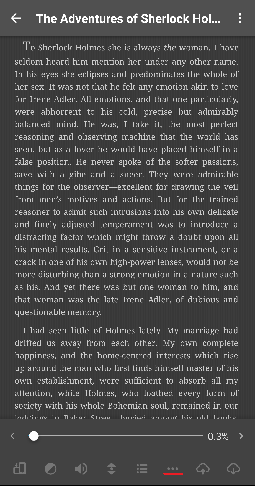
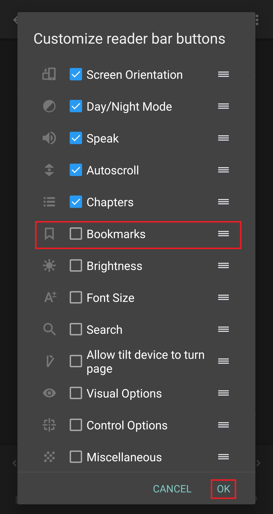
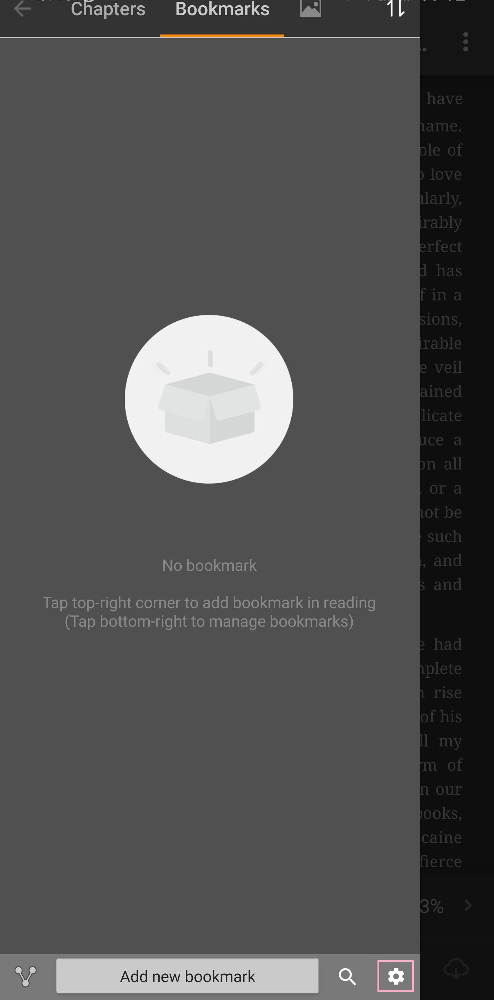
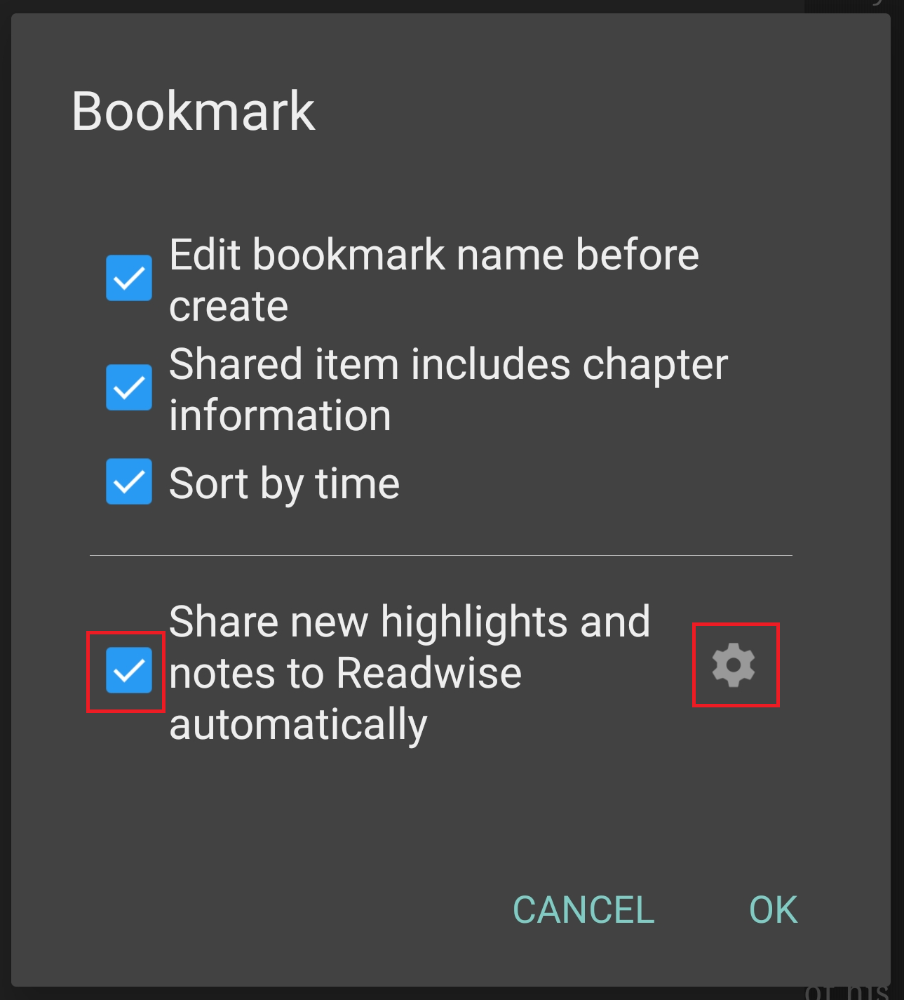
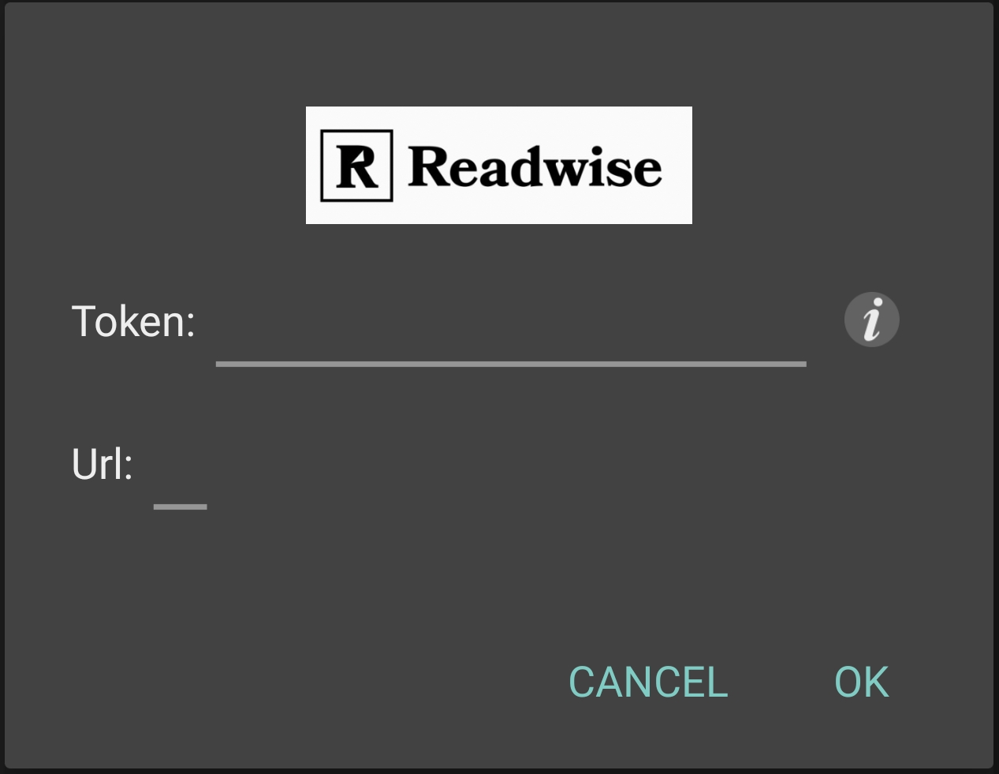
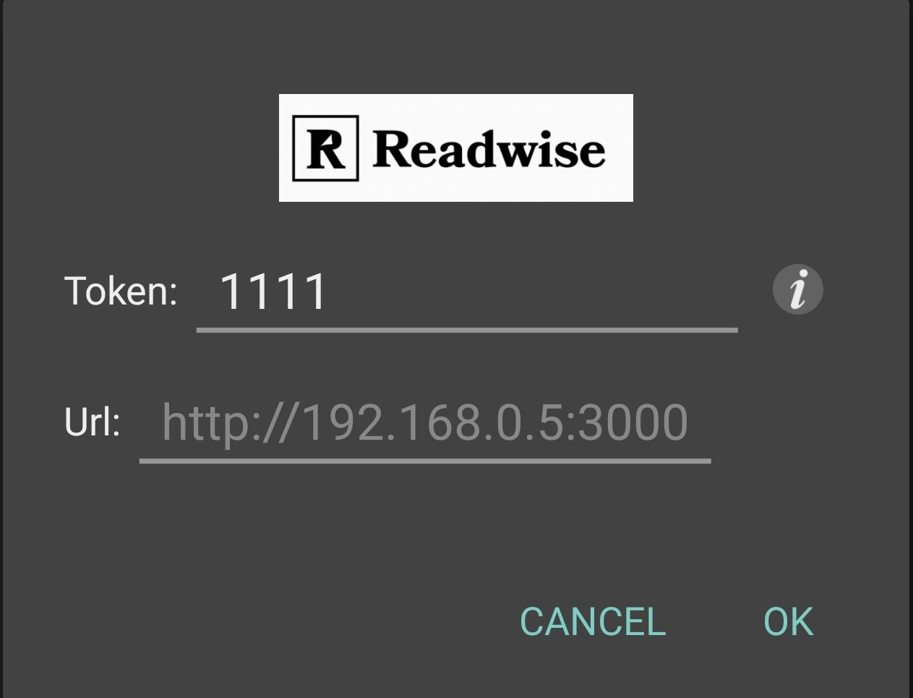
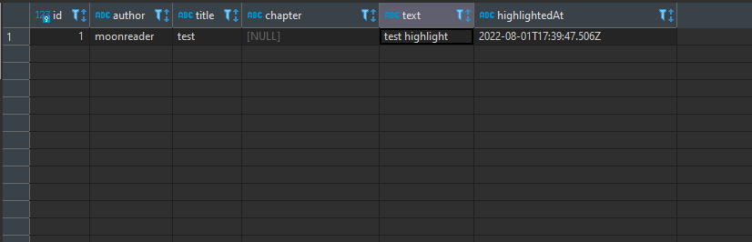

1. Open Moon+ Reader and select any book from your bookshelf
2. Press on three dots icon for settings

3. In dialog menu enable checkbox for **Bookmarks** and click **OK**

4. In bottom menu should appear a new icon which allow you to control bookmarks

5. On left-side menu click on **Settings** icon

6. Enable `Share new highlights and notes to Readwise automatically` and click on right icon from option

7. Those fields are used to connect **Moon+ Reader** to [Readwise.io](https://readwise.io/) API, but we will use our, custom endpoint.

Fill `Token` field with any symbol or text. **It shouldn't be empty.**

In `Url` insert your endpoint IP

8. Press **OK**

9. If everything is good you should see in console and your database **Moon+ Reader** test values.

Everytime when you highlight something it automatically requests **API** and save highlighted note in **SQLite database**.